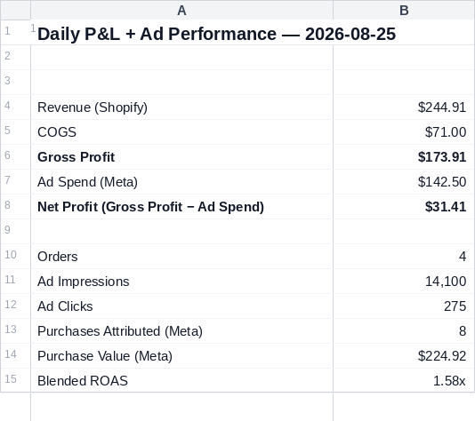
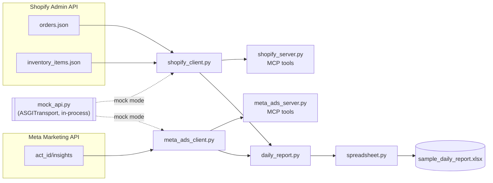

# Ecommerce MCP Automation

**A sample Claude Code + MCP integration:** Shopify and Meta Ads exposed as
MCP tools, plus a reporting agent that pulls both into one formatted daily
P&L + ad-performance spreadsheet — no manual copy-paste between platforms.

> **This is a demonstration built against the public Shopify Admin API and
> Meta Marketing API docs — not something that has run a real business.** It's
> a clean-room sample: real endpoints, real auth, real pagination, real error
> handling, written fresh to show exactly how this kind of automation gets
> built. It runs end-to-end in **mock mode** with zero credentials (realistic
> fixture data standing in for live responses), and switches to **live mode**
> per-integration the moment real credentials are set — see
> [How to run](#how-to-run).
>
> The Shopify client has been run live against a real Shopify Partners
> **development store** (a sandbox store, not a production business) —
> real auth, a real order, real API responses. That process surfaced and
> fixed two real nullability edge cases (see
> [Known simplifications](#known-simplifications)) that the mock fixtures
> alone hadn't covered. Meta Ads runs against the mock transport by default
> in this repo; the client code is written the same way and switches to live
> the moment `META_ACCESS_TOKEN`/`META_AD_ACCOUNT_ID` are set.

## What it does

- Exposes Shopify orders, revenue, and COGS as MCP tools (`get_orders`,
  `get_daily_pnl`)
- Exposes Meta Ads spend, impressions, purchases, and ROAS as MCP tools
  (`get_insights`, `get_daily_ad_performance`)
- Runs a reporting agent (`daily_report.py`) that pulls both **concurrently**
  and writes a formatted `.xlsx` — Summary, Orders, and Ad Performance sheets
- Ships a [Claude Code Skill](skills/daily-report/SKILL.md) that wraps the
  whole workflow behind a natural-language trigger ("run the daily report")
- Includes a committed [sample output](examples/sample_daily_report.xlsx) so
  the result is visible without running anything

## Sample output



*Rendered preview of the Summary tab — [open the actual generated
workbook](examples/sample_daily_report.xlsx) for the live file (with the
Orders and Ad Performance sheets, currency/ROAS formatting, and frozen
header rows).*

## Architecture



The two API clients (`clients/shopify_client.py`, `clients/meta_ads_client.py`)
are genuine integration code — real endpoint URLs, real auth headers, real
pagination loops, real 429 backoff. The **only** thing that changes between
mock and live mode is the HTTP transport (`clients/http.py`):

- **Live:** `httpx.AsyncClient` opens a real connection to Shopify / Meta.
- **Mock:** `httpx.AsyncClient` is given an `httpx.ASGITransport` pointed at
  an in-process FastAPI app (`fixtures/mock_api.py`) serving realistic
  fixture payloads. No port is bound, no subprocess runs — but requests still
  travel through genuine HTTP/ASGI routing, headers, and JSON encoding.

That means the client code a reviewer reads is the same code that would run
against a live store — not a mock dressed up to look like one. See
[CLAUDE.md](CLAUDE.md) for the full conventions.

## How to run

### Mock mode (default — zero credentials)

```bash
git clone <this-repo> && cd ecommerce-mcp-automation
python -m venv .venv && source .venv/bin/activate   # or: uv sync && source .venv/bin/activate
pip install -e ".[dev]"

python -m ecommerce_mcp.reporting.daily_report
# -> Wrote examples/sample_daily_report.xlsx
```

Run the test suite the same way, no setup needed:

```bash
pytest
```

### Live mode

Copy `.env.example` to `.env` and fill in what you have — each integration
switches to live independently the moment its own credentials are present,
so you can run Shopify live with Meta still mocked (or vice versa):

```bash
cp .env.example .env
# SHOPIFY_STORE_DOMAIN=your-dev-store.myshopify.com
# SHOPIFY_ACCESS_TOKEN=shpat_...          (Partners dev store -> custom app -> Admin API token)
# META_ACCESS_TOKEN=EAA...                (System User token, ads_read scope)
# META_AD_ACCOUNT_ID=act_1234567890
```

### As MCP servers (Claude Code / Claude Desktop)

Add to your MCP config (`.mcp.json` for Claude Code, or Claude Desktop's
config file). Point `command` at the project's venv interpreter directly —
MCP clients don't source your shell profile, so a bare `python` won't see an
activated venv:

```json
{
  "mcpServers": {
    "shopify": {
      "command": "/path/to/ecommerce-mcp-automation/.venv/bin/python",
      "args": ["-m", "ecommerce_mcp.mcp_servers.shopify_server"],
      "cwd": "/path/to/ecommerce-mcp-automation"
    },
    "meta-ads": {
      "command": "/path/to/ecommerce-mcp-automation/.venv/bin/python",
      "args": ["-m", "ecommerce_mcp.mcp_servers.meta_ads_server"],
      "cwd": "/path/to/ecommerce-mcp-automation"
    }
  }
}
```

Then ask Claude things like "what's today's Shopify P&L?" or "get me
yesterday's Meta ad performance" — it'll call the tools directly, in mock
mode by default.

### As a Skill

`skills/daily-report/SKILL.md` wraps the report-generation workflow so
Claude Code runs it on a natural-language trigger ("run the daily report")
rather than needing the exact CLI command. **The full-report path doesn't
need the MCP config above at all** — it runs `daily_report.py` directly,
which calls the clients as plain Python, no MCP involved. MCP config is only
needed for the Skill's other path: answering a one-off single-metric
question ("what's today's ROAS?") by calling `get_daily_pnl` /
`get_daily_ad_performance` as MCP tools instead of running the whole report.

## Project layout

```
src/ecommerce_mcp/
  clients/         Typed, async API clients (Shopify + Meta), transport-swappable
  mcp_servers/      MCP tool servers wrapping the clients
  reporting/        daily_report.py (orchestration) + spreadsheet.py (openpyxl)
  fixtures/         Realistic mock payloads + the in-process mock API app
skills/daily-report/ Claude Code Skill for the reporting workflow
tests/              pytest suite (all run against mock mode)
examples/           Committed sample .xlsx + README preview image
```

## Known simplifications

Documented here rather than hidden, since precision matters more than
polish for a sample like this:

- **COGS** uses Shopify's `InventoryItem.cost` field via the real two-hop
  lookup (variant → `inventory_item_id` → batched `inventory_items` fetch)
  — Shopify doesn't expose cost on the order line item directly. Both `cost`
  and line-item `sku` are nullable on a live store (a merchant may never have
  set them) — found via live testing against a real dev store, not from the
  docs alone. Both are handled as zero-cost / missing-SKU rather than erroring.
- **Refunded orders** are excluded entirely from revenue/COGS/order count in
  `daily_pnl()`. Partial refunds/returns accounting would need the Refund
  resource — out of scope here.
- **Meta purchase attribution** uses the `purchase` action type from the
  `actions`/`action_values` arrays at whatever attribution window the ad
  account is configured with — this client doesn't override it.
- The reporting agent currently pulls **all** available orders/insights
  rather than filtering by date range; a production daily cron would pass
  `created_at_min`/`time_range` for the target day.

## License

MIT — see [LICENSE](LICENSE).
